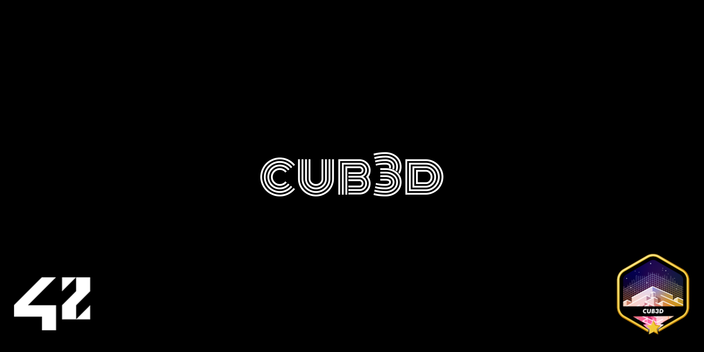
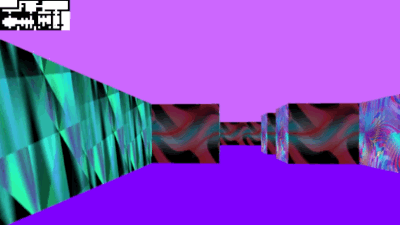

# Cub3D



Welcome to **Cub3D**, our 3D maze exploration project inspired by the classic Wolfenstein experience. This endeavor at 42 Berlin challenged us to dive into **ray-casting**, **mathematics**, and **low-level graphics programming**. Working as a team, we built a first-person view of a maze using C, the MiniLibX library, and clever algorithms. Along the way, we deepened our understanding of computer graphics, event handling, and process management.

---

## About

**Cub3D** is more than a coding exercise—it’s an immersive lesson in geometry, linear algebra, and rendering. We combined these elements with C programming and MiniLibX to:

- **Calculate Wall Distances:** Using the DDA algorithm, we cast rays from the player’s viewpoint to detect walls, determine distances, and create a realistic sense of depth.
- **Render Textures & Colors:** We integrated various wall textures and assigned distinct colors for floors and ceilings, adding a dynamic and visually engaging environment.
- **Smooth Player Movement:** Navigate the maze with `W, A, S, D` to move and arrow keys to look around, all while ensuring collision detection with walls.
- **Responsive Window Handling:** Our window responds gracefully to focus changes, user interactions, and closing events, thanks to effective event management.

This project taught us that graphics programming is about orchestrating multiple systems—from parsing configuration files and loading textures to aligning pixels on the screen.

---

## Project Highlights

- **Program Name:** `cub3D`
- **Files Submitted:** All source files and a Makefile with `all`, `clean`, `fclean`, `re`, and `bonus` targets.
- **Arguments:** A single `.cub` configuration file containing texture paths, colors, and a map layout.
- **Authorized Functions:**  
  - I/O: `open`, `close`, `read`, `write`
  - Process: `malloc`, `free`, `perror`, `strerror`, `exit`
  - Math: All functions from the math library `-lm`
  - Graphics: All functions from the MiniLibX
- **Libft Authorized:** Yes

**Description:**  
Create a first-person, “realistic” 3D view inside a maze using ray-casting. The player can move and look around, and the environment is defined by a `.cub` file specifying textures, colors, and a properly walled map.

---

## Core Mechanics

**Cub3D** brings essential 3D concepts to life:

1. **Ray-Casting:** We shoot rays from the player’s position in various directions. Each ray detects the distance to the nearest wall using the DDA algorithm, allowing us to project walls onto the screen with correct scaling.
2. **Map Parsing:** We read a `.cub` file to load:
   - **Textures:** North, South, East, West wall textures.
   - **Colors:** Floor and ceiling colors in RGB format.
   - **Map Layout:** `1` for walls, `0` for open space, and `N, S, E, W` for the player’s initial position/orientation.
3. **Movements & Interactions:**
   - **W, A, S, D:** Move through the maze
   - **Left/Right Arrows:** Rotate the player’s view
   - **ESC / Red Cross:** Exit the program gracefully
4. **Image Rendering:** Using MiniLibX, we draw each frame by calculating wall heights and painting them with the appropriate textures and colors.
5. **Error Handling:** If the configuration file is invalid or the map is not properly walled, we exit with a clear error message.

---

## Bonus Features

After perfecting the mandatory requirements, we implemented several bonuses to enhance the gameplay experience:

- **Wall Collisions:** Prevent the player from walking through walls, ensuring realistic navigation.
- **Minimap System:** Provide a top-down view of the maze to help orient the player.
- **Mouse Rotation:** Allow camera rotation by moving the mouse, offering smoother and more intuitive control.

These additions make **Cub3D** feel more interactive and player-friendly.

---

## Challenges & Learnings

**Cub3D** pushed us to refine our skills in:

- **Math & Geometry:** Understanding trigonometry and DDA line traversal to accurately determine wall distances.
- **Memory Management & Performance:** Ensuring each frame renders efficiently, handling textures correctly, and avoiding leaks.
- **Event Handling & Interactivity:** Capturing keystrokes, mouse movements, and window events smoothly.
- **Code Organization & Teamwork:** Dividing complex tasks, maintaining consistent coding styles, and documenting our progress clearly.

From learning how to control each pixel on the screen to ensuring smooth camera movements, **Cub3D** taught us that every detail matters in delivering a quality experience.



---

## Getting Started

1. **Clone the Repository:**
   ```bash
   git clone https://github.com/your-team/cub3d.git
   cd cub3d
   ```

2. **Build the Project:**
   ```bash
   make
   ```
   After successful compilation, you’ll have the `cub3D` executable ready.

3. **Run Cub3D:**
   ```bash
   ./cub3D path/to/map.cub
   ```
   Navigate the maze, look around, and enjoy the first-person experience!

---

## Contributing

We welcome contributions! If you’d like to suggest improvements, fix bugs, or add new features, feel free to open an issue or submit a pull request. Let’s build a better **Cub3D** together.


---


**Thank you for exploring Cub3D! 🧊**  
We hope our experience inspires you to delve deeper into graphics programming, game development, and the art of turning math into magic on the screen.
